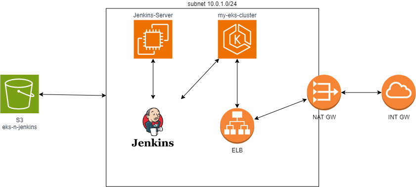

# EKS-n-Jenkin
## Project : 
Real-time End-to-end DevOps project: Deploying an EKS Cluster with Terraform and Jenkins

## What does it do?

0. On AWS console Create S3 bucket with name "eks-n-jenkins"

1. Create an EC2 instance + Jenkins
2. Write tf code for EKS cluster
3. Push the code to Github
4. Create Jenkins pipeline -> EKS cluster
5. Deploy the changes to AWS
6. Implement a deployment file -> kubectl -> nginx -> accessing

